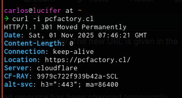

# M8 AE2 Servidor RESTful con "productos"

Carlos Pizarro Morales
Sebastián Gallegos Frías

## Contexto

El objetivo de esta actividad es que los equipos colaboren para crear un servidor REST funcional utilizando Express, implementando rutas con distintos verbos HTTP, manejando parámetros, respuestas en formato JSON, códigos de estado y buenas prácticas en la estructura de los endpoints.

## Instrucciones

Organícense en equipos. El equipo deberá:

### Parte 1: Inicialización del proyecto

- Crear un nuevo proyecto Node.js.
- Instalar Express y configurar un archivo principal (`server.js` o `index.js`).
- Usar `express.json()` para habilitar el procesamiento de datos en formato JSON.

### Parte 2: Creación de rutas

- Implementar rutas REST con retorno JSON para los siguientes casos:
    - `GET	    /productos`	Devuelve una lista de productos.
    - `POST	    /productos`	Recibe un producto nuevo y lo guarda.
    - `PUT	    /productos/:id`	Actualiza un producto según su ID.
    - `DELETE	  /productos/:id`	Elimina un producto según su ID.
- Cada respuesta debe ser un objeto JSON estructurado que indique el estado de la operación y el recurso afectado.

### Parte 3: Parámetros y procesamiento

- Implementar rutas que reciban parámetros:
    - Por URL (`req.params`)
    - Por query string (`req.query`)
    - Por cuerpo de la petición (`req.body`)
    - Procesar y mostrar en la respuesta todos los datos recibidos.

### Parte 4: Códigos de respuesta

- Implementar respuestas con los códigos HTTP apropiados:
    - 200 OK
    - 201 Created
    - 400 Bad Request
    - 404 Not Found
    - 500 Internal Server Error
- Simular un error controlado y enviar un código y mensaje de error personalizado (ej. si el nombre del producto está vacío, responder 400).
- Agregar comentarios o un documento auxiliar explicando brevemente los distintos rangos de códigos HTTP (1xx, 2xx, 3xx, 4xx, 5xx). 

> NOTA: Puedes leer esto [**acá**](#códigos-de-respuesta-http).

### Parte 5: Documentación corta del equipo

- Agregar un archivo README.md (o incluir comentarios en el código) donde respondan:
    - ¿En qué casos se utiliza cada tipo de petición HTTP?
    - ¿Cómo debe estructurarse un endpoint según la operación?
    - ¿Cuál fue el mayor reto en la creación de este servidor?

> NOTA: Puedes leer respuestas a esas preguntas en la siguiente sección ["Notas"](#notas)

## Códigos de respuesta HTTP

Los códigos http son codigos numéricos de 3 digítos que se utilizan para comunicar el grado de éxito de la request a la que están asociados. Forman parte de la primera línea de una respuesta típica http como por ejemplo acá:

```
HTTP/1.1 200 OK  <-- AQUI
Date: Fri, 01 Nov 2025 06:45:00 GMT
Content-Type: application/json; charset=utf-8
Content-Length: 78
Connection: keep-alive
Cache-Control: public, max-age=600

{
    "id": 15,
    "name": "Widget Deluxe",
    "status": "In Stock",
    "price": 49.99
}
```
También con un ejemplo real (dice que no nos pesca por http): 


Actualmente se utiliza un rango de valores que va desde el 100 hasta el 599 para definir categorías de respuestas (**no hay 500 respuestas, solo 5 rangos y un poco más de 50 respuestas**):

- **100-199**: Respuestas informativas, lo más importante es que no llevan body. Solo headers.
- **200-299**: Respuestas exitosas. Buee. Ya lo dice.
- **300-399**: Respuestas de redirección. Permiten informar cambios en el esquema de URIs que afectan a un recurso.
- **400-499**: Errores de parte del cliente: prohibido, no autorizado, request mal formada, etc.
- **500-599**: Errores del servidor: _No tenemos idea de qué sucedió, pero estamos trabajando para usted..._

La pregunta pide que sea una explicación breve, así que si quieres mirar en detalle puedes leer acá [**MDN**](https://developer.mozilla.org/en-US/docs/Web/HTTP/Reference/Status)

## Notas

- He implementado el proyecto de forma sencilla (dentro de lo posible) pero en capas: 
  - `config/` para la base de datos (utiiza pg), y la configuración del server
  - `controllers/` para las funciones handler de las rutas de los productos, middleware y ruta raíz
  - `routes/` definición de los endpoints para `/productos`
  - `tests/` para los tests en bash (los puedes ejecutar en Gitbash si usas Windows)
- Además, esta vez para dejar aún más limpia la lógica del server, he movido todos los handlers fuera del server. Esto me permite mirar "qué hace" sin distraerme con el "cómo". 
- Además de los endpoints explícitamente solicitados, existen:
  - `/` con información de los demás endpoints.
  - `GET    /productos/:id` para obtener un producto por id
  - `DELETE /productos/purge` para eliminar todos los registros en la BD.
  - `GET    /productos?categoria=:categoria` para filtrar y
  - `GET    /productos?limit=5&offset=0` para paginar.
  - Filtrar y paginar se pueden combinar.
- El proyecto está conectado a una base de datos PostgreSQL de nombre `m8_api_productos` con las credenciales indicadas en el archivo `.env.example` 
- Aunque el ejercicio no lo pide, se han aplicado prácticas HATEOAS en las responses, utilizando el patrón visto en el material del curso, algo similar a:

```json
{
  "data": [
    { "id": 101, "nombre": "Camiseta", "precio": 12000, "categoria": "ropa" },
    { "id": 102, "nombre": "Pantalón", "precio": 25000, "categoria": "ropa" }
  ],
  "links": [
    { "rel": "self", "href": "/api/productos?categoria=ropa&limit=2&offset=0" },
    { "rel": "next", "href": "/api/productos?categoria=ropa&limit=2&offset=2" }
  ],
  "meta": {
    "total": 10,
    "limit": 2,
    "offset": 0,
    "filtros": {
      "categoria": "ropa"
    }
  }
}
```

### Como utilizar

```bash
# En el directorio donde crearás el proyecto:
git clone https://github.com/gh-de-carlos/m8.ae2.rest.productos

# Navega al nuevo directorio
cd m8.ae2.rest.productos

# Instalar dependencias
npm install

# Crear una bd
sudo -i -u postgres
psql
# CREATE DATABASE m8_api_productos [WITH OWNER=tu_user];
exit;

# Iniciar el server
npm start

# El servidor está funcionando y tiene un set de 10 productos
# cargados. Ahora, desde una terminal distinta puedes ejecutar
# los tests o comenzar a realizar requests a los endpoints
# disponibles. 
# Por ejemplo, los tests completos: 
npm test

# Cargar el mismo set de 10 productos desde un script
npm run load-data
```

Puedes leer más en [`tests/README.md`](./tests/README.md) para obtener más detalles sobre el uso de los tests.

TODO: solo faltan capturas de datos.
